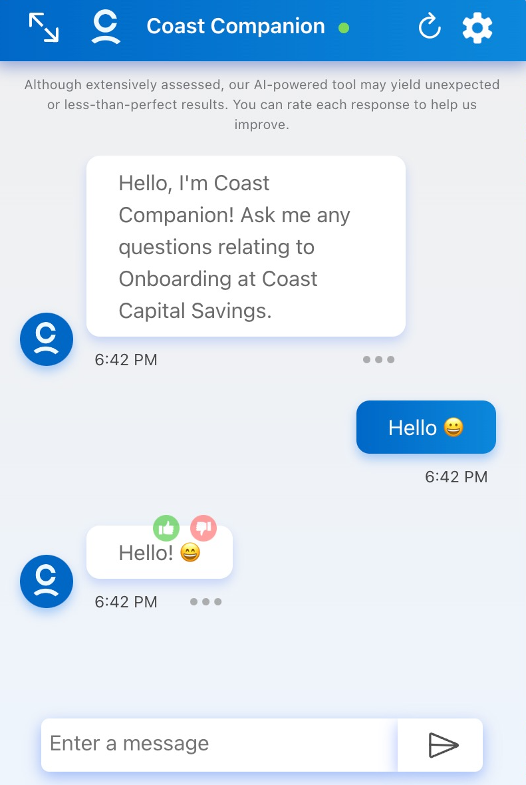
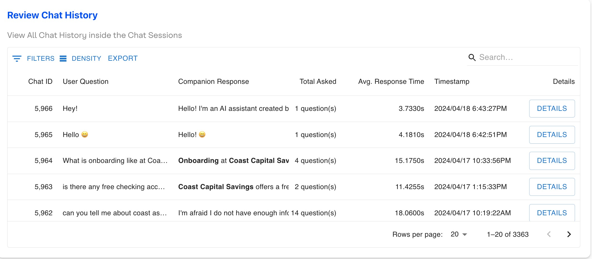
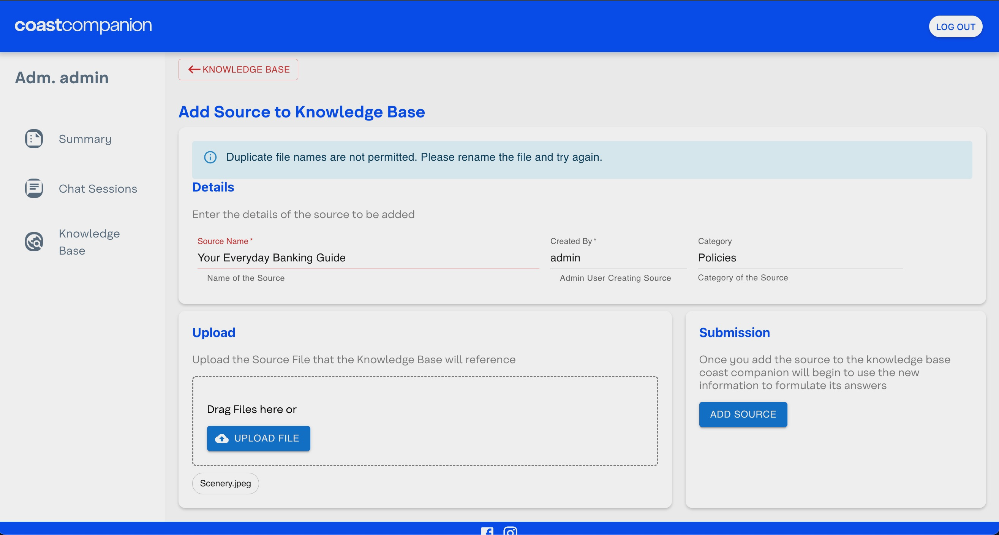

# Version 1.0.0 - Release Notes

## Features

### New Password Page on New Login
- Enhanced password security and user experience through a new "reset password on first login" feature to eliminate the need for developers to directly set passwords in AWS Cognito/Relational Database Service (RDS). Users can now set a secure password themselves upon first login.

### Database Modifications
- Changed database schema and API configurations to support unicode characters, allowing more expressive communication through the inclusion of symbols and emojis.
  - 
  - 

## Bug Fixes

### "Invalid Date"
- Addressed issues where dates in tables and graphs were displayed as 'Invalid Date' so users can view accurate date representation throughout the interface.

### Missing Recent Chats Made Simultaneously From "Review Chat History" Table in "Chat Sessions" Page
- Investigated this bug described in the Warranty Period (WP) feedback but were unable to reproduce the bug.
    - During testing, we were able to see new chat sessions in the admin panel immediately after they were executed.

### Helpful Error Messages
- Added more error messages to provide more detailed and actionable information to troubleshoot or resolve issues.
    - For example, Amazon S3 requires files within the same bucket to have unique names. Users uploading files with duplicate names would result in a failure, followed by an "Oopsies" page. Now, users are given useful error messages to avoid any confusion.
    - 

### Knowledge Base Resources
- Eliminated the necessity of navigating back through multiple pages, opening items from the knowledge base opens a new tab.

### Upload Knowledge Base (KB) Files
- Restored functionality for administrators to upload files to KB by resolving bugs.

### Chatbot Hallucinations Reduced
- Reduced chatbot hallucinations using different hyperparameters to choose the most-likely candidates for the next token in the sequence more consistently.
    - After experimenting with various hyperparameter values for the model and conducting extensive testing using our proprietary test suite, we found that reducing Top P and Top K values mitigates issues with diversity in chatbot responses the best.

## Summary

This term, our objective was to provide Coast Capital Savings and its employees with a valuable and efficient solution, harnessing the power of cutting-edge generative AI technologies. Our solution encompassed critical aspects of security, scalability, and compliance throughout its development lifecycle. 

For the final release, we have implemented several changes to further accomplish our goal and deliver value to Coast Capital Savings. One notable addition is the new feature requiring password changes upon initial login. This enhancement not only improves wait times and usability but also demonstrates our commitment to security and compliance, as Coast Capital administrators will no longer need to share their passwords with developers.

Significant effort have also been dedicated to squashing bugs identified during work-in-progress (WIP) testing. Resolving these issues was a major priority, as it directly improves the usability and reliability of our program.

Furthermore, the introduction of unicode character support enables users to express their questions and concerns more flexibly, incorporating elements such as emojis rather than relying solely on textual input.

Additionally, the chatbot's hyperparameters were carefully tuned to reduce randomness and diversity in responses, aiming to mitigate potential conflicts where different individuals receive conflicting answers to the same query.

Overall, our changes during the warranty period complement the hard work we have invested throughout this term by addressing bugs, fine-tuning the model, and introducing new features that bolster security and compliance. These enhancements solidify our commitment to delivering a robust and user-friendly solution tailored to the needs of Coast Capital Savings and its employees.
